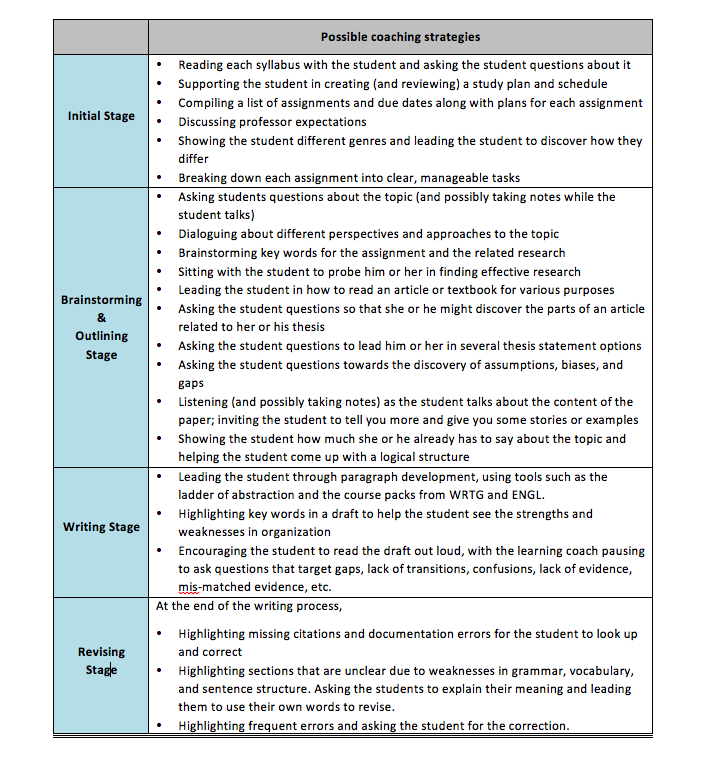

A significant part of the facilitator's role will be to provide academic coaching for FAR centre students. Coaching can happen with a group of students or one-on-one, and both situations require facilitators to consider the best principles and practice to inform their coaching. Here is TWU's Learning Coach Manual used by the university's academic coaches, which outlines the essential principles and practices of coaching.

---
## Learning Coach Manual (2016)##

### Our goal:

Learning Coaches lead university (graduate and undergraduate) students in developing academic and linguistic confidence with the ultimate goal of fostering metacognition, self-awareness, and independence.

Grolnick and Raftery-Helmer (2015) describe the kind of learner we hope to see: “Proactive, self-regulated learners are problem solvers: They seek out information, take steps to master material, and persist when tasks are challenging” (p. 252).

### Definition of a coach:

A coach meets students where they are at and provides direction, encouragement, correction, and wisdom to help the students become all they can be. The work of a coach is process-focused, not product-focused. It is relational, not clinical. A coach is not an editor or tutor, not a “fixer” or a doctor. Coaches support the scholarly development of learners as they work on specific tasks, with clear targets.

According to Wang (2013), coaching draws on Vygotsky’s concept of “the zone of proximal development” and scaffolding in that it assumes:

1.  The essentially dialogic nature of discourse in which knowledge is co-constructed;
2.  The significance of the authentic and cognitively challenging tasks in which it is embedded;
3.  The role of social mediation and the establishment of inter-subjectivity as shared understandings between learners and teachers;
4.  The transfer of responsibility for the task to the students as the major goal (p. 38).

### Towards self-regulated learning

*Self-regulated learning* (SRL) is a term that helps us understand students who are active, who “learn with volition and agency” (Grolnick & Raftery-Helmer, 2015). In contrast, students who are not self-regulated tend to blame others for their failures because they perceive a threat. Research in SRL has found that there are educational strategies to increase the atmosphere for SRL.

A related theory is Self-determination theory, which states that everyone has needs for “competence, relatedness, and autonomy. According to this perspective, the satisfaction of these needs is essential for well-being, whereas their thwarting results in a disturbance of functioning” (Grolnick & Raftery-Helmer, 2015, p. 254).
- Competence – the sense of having control over one’s environment, not being a victim or helpless.
- Relatedness – being in relationship with others, being valued and cared for, which leads to a feeling of freedom to take risks in learning
- Autonomy – being able to make one’s own decisions and do things independently, motivated by a sense of value and pleasure in learning

Holec (1980) is widely quoted in his definition of autonomy: “to say of a learner that he is autonomous is to say that he is capable of taking charge of his own learning” (as cited in Schmenk, 2005).

The constructivist model of learning sees knowledge as it is constructed and negotiated by the learner. “In these environments of interaction, the teacher becomes the learning facilitator, planning tasks and supporting responsibility for learning (Koç, 2006), providing students with options, helping them make their own decisions and solve problems for themselves. Consequently, this new focus provides students with opportunities to ask their own questions, and create their own learning concepts and strategies based on existing knowledge. The teacher has to accept students’ autonomy and their enterprising spirit, and support them in this sense.” (Moreno-Murcia, 2016).

A question to consider is whether “learner autonomy” is a cultural concept. Is it something we can reasonably and fairly expect of our global students? What do we need to do to lead our students toward autonomy?

How can our programs create an environment that fosters self-regulated learning? According to Grolnick and Raftery-Helmer (2015), programs need to focus on supporting autonomy, not control, on a structured environment that can lead to competence, and on relationships that encourage participation.

- Autonomy-building – through our interactions with students so that we ask for and value their opinions, perspectives, and initiatives
- Relatedness – through demonstrating love by giving our time and focused attention, and through recognizing emotion as valid
- Competence – through clear and consistent rules, policies, expectations, and consequences, , and through helping the learners figure out how to be successful and avoid failure in this new cultural and educational context; our programs should give opportunity for the learners to influence the curriculum and the learning environment (See Benson (1997) for concepts of technical, psychological, and political autonomy).

Therefore, the primary goal of Learning Coaches is to invest time in building a relationship with each student. The goal of this relationship is trust, not dependency.

Wang (2013) writes, “In a coaching relationship, it is very important for the coach to model and provide good feedback for the person being coached… However, feedback cannot happen without trust and safety. Establishing rapport and connection is important at the beginning as well as maintaining this trust through the coaching process. (p. 46).

**Specific Strategies for Self-Regulated Learning**

- Give students choices and when choices are restricted, discuss why
- Use inviting language, such as “I’m interested in your idea. Can you tell me more about it?”
- Be in tune to the learner’s personal state during a session and adapt accordingly (Reeve, 2006; as cited in Moreno-Murcia, 2016).
- Do not shut down a student’s perspective or thought. Lead the student to ask themselves questions and seek more clarity on it.
- Do not pressure the learner to accept your thought or perspective
- Provide structure for each session. Help the learner understand the expectations for being successful in your sessions.
- Encourage the learner to evaluate his or her sources of support, whether material or human
- Welcome complaints and negative affect. Validate these emotions.  
- Never use guilt or shame tactics.

### Social Competency

The transition to university is risky and stressful. For students in our programs (global students, students with undeveloped academic skills or learning disabilities), the first year can be even more challenging. The Learning Coach, in working out of the foundation of relationship, has a role in walking with students through the social demands of this transition.

According to a study by Mellard and Hazel (1992), social competency can be examined by looking at the following domains:

1.  Language – “understanding others and making oneself understood”
2.  Pragmatics – interpreting a social situation, understanding expectations, interpreting comments as positive or negative
3.  Humor – realizing when someone is joking
4.  Personal-social involvement – participating in social activities and going out with friends
5.  Peer relations – how well other people get along with you; whether or not people avoid you
6.  Helpfulness – understanding other people’s feelings and needs; understanding your own
7.  Applied academics – functioning in everyday life, such as filling out forms and comparing prices
8.  Money management – understanding costs, budgeting, making payments
9.  Coping – responding to stress and challenges, such as criticisms, changes in routine, expectations, and pressure
10. Time management – scheduling and prioritizing
11. Personal responsibility – knowing personal information, organizing yourself, keeping appointments, etc.
12. Goal setting – organizing tasks, recognizing the need for help or resources, solving problems

Our students may struggle in one or more of these domains. It is not the role of the Learning Coach is to teach them the skills. According to Mellard & Hazel (1992), although it may be true in some cases that the learner has never acquired the skill, the weakness may be related to the absence of motivation to use the skill or paralysis due to “competing emotional responses such as anxiety” (p. 266).

The Learning Coach may attempt to dialogue with the student to try to understand the cause, but in many cases, the Learning Coach can refer the student to the Student Success Centre or a Counselor.

### The Daily Work of the Learning Coach

Learning Coaches should not focus on correcting grammar. Rather, this sentence-level focus should come as a *final step* of support in all written assignments. The coach might help students develop their grammatical accuracy and their lexical range through targeting key errors and key structures (see Grammar Syllabus), but all discussion of sentence-level language should work towards *learner development* rather than editing or “cleaning up” an essay.

The work of the learning coach might involve:

### Possible coaching strategies

#### Initial Stage

- Reading each syllabus with the student and asking the student questions about it.
- Supporting the student in creating (and reviewing) a study plan and schedule.
- Compiling a list of assignments and due dates along with plans for each assignment.
- Discussing professor expectations.
- Showing the student different genres and leading the student to discover how they differ.
- Breaking down each assignment into clear, manageable tasks.

#### Brainstorming & Outlining Stage

- Asking students questions about the topic (and possibly taking notes while the student talks).
- Dialoguing about different perspectives and approaches to the topic.
- Brainstorming key words for the assignment and the related research.
- Sitting with the student to probe him or her in finding effective research.
- Leading the student in how to read an article or textbook for various purposes.
- Asking the student questions so that she or he might discover the parts of an article related to her or his thesis.
- Asking the student questions to lead him or her in several thesis statement options.
- Asking the student questions towards the discovery of assumptions, biases, and gaps.
- Listening (and possibly taking notes) as the student talks about the content of the paper; inviting the student to tell you more and give you some stories or examples.
- Showing the student how much she or he already has to say about the topic and helping the student come up with a logical structure.

#### Writing Stage

- Leading the student through paragraph development, using tools such as the ladder of abstraction and the course packs from WRTG and ENGL..
- Highlighting key words in a draft to help the student see the strengths and weaknesses in organization.
- Encouraging the student to read the draft out loud, with the learning coach pausing to ask questions that target gaps, lack of transitions, confusions, lack of evidence, mis-matched evidence, etc..

#### Revising Stage
At the end of the writing process:

- Highlighting missing citations and documentation errors for the student to look up and correct.</li>
- Highlighting sections that are unclear due to weaknesses in grammar, vocabulary, and sentence structure. Asking the students to explain their meaning and leading them to use their own words to revise..
- Highlighting frequent errors and asking the student for the correction.

#### Miscellaneous
If the assignment is a presentation:

- Inviting students to give a mock presentation to practice and receive feedback.
- Asking students questions about how they read their textbooks, listening and offering new strategies for optimizing both time and comprehension.
- Asking students questions that lead them to develop awareness of their study strategies.

### Meta-cognition and the Role of the Learning Coach

Student progress towards self-regulated learning is related to the ability to analyze and articulate their own learning and learning tasks.

**Process**

Wismath, Orr & MacKay (2015) analyze different “thresholds” during problem-solving learning. Students need time to reach each threshold. They report that students in their study needed to discover on their own that learning requires persistence.

The Learning Coach sessions should reinforce meta-cognitive skills by re-using the terms and by asking students to talk through their own essays as well as the feedback from the professor. Students have learned (or are learning) meta-language in their WRTG and ENGL courses, so this becomes a shared meta-language when the learning coach sessions employ it, too.

The Learning Coach sessions are weekly safe places for practicing the kinds of thinking and analysis the students are beginning to build. This highlights again that the nature of the Learning Coach work should not be end product-focused: “Modeling metacognitive discussion in \[sessions\], and requiring metacognitive reflection by students on assignments, can promote an increasing awareness of problem solving as a journey and not a destination or answer only. Allowing students to figure out how to learn from their mistakes can also enhance an appreciation of the process of problem solving, rather than the process of getting a quick right answer” (Wismath, Orr & MacKay, 2015).

**Understanding the disciplines**

During Learning Coach interactions, there will be many opportunities to discuss similarities and differences between the various disciplines the students are engaged in. The Learning Coach should lead the student to discover how to be successful in each discipline by asking them questions and drawing their attention to specific features (such as the use of statistics in social science or primary sources in history).

### Guidelines for best practices:

Learning Coaches are guided by ASKING QUESTIONS and LISTENING. Their role is not to tell or *control* the learning environment. They should not give the student ideas, impose their own ideas on students, tell them what to write, or fix things. Most of the time, the “pen” (whether literal or digital) should be in the hand of the student.

**Considering these principles, the Learning Coach follows these parameters:**

- No editing
- No online feedback on drafts – only face-to-face (with occasional exceptions in extenuating circumstances)
- Digital communication is fine for questions or conversation, such as discussing a thesis statement

**Process for looking at a paper:**

- Read the assignment from the professor and ask the students if they feel they have addressed these requirements. Ask a lot of questions and suggest that the student clarify with the professor.
- Check the big picture – whether the assignment meets the requirements. (For example, if the assignment is a research paper, does the student use research? Does it include all the required sections? Is it working towards a suitable length?
- Reading \#1 – read it without stopping or making notes to get a sense of the flow of the essay and whether it meets the assignment requirements and whether it is the student’s own work
- Reading \#2 - read it for logic and cohesion, using a highlighter to identify key words throughout. Help the student visualize whether the parts fit together or not.
- Reading \#3 – read it for evidence to determine whether the student has used the right kind of evidence and sufficient evidence. Use questioning to help the reader discover gaps, mis-matched research, and weak integration of research. Discuss the kind of evidence they need (according to the assignment itself, the discipline, and the genre).
- Reading \#4 – read it for sentence-level recommendations. Point out all the sections in which you cannot understand due to grammar and ask the learner to explain the meaning to you. Identify wrong uses of words and ask the student to explain his or her meaning. Suggest a few options but allow the student to choose. Point out the students’ most common problem areas for grammar and ask the student how to correct them. DO NOT PICK UP THE PEN AND CORRECT EVERYTHING YOURSELF.
- Final step: ask student what the rules are for formatting, use of documentation, and references page. Lead the student to tell you what he or she knows and direct them to the resources that are available to them, such as their coursepack or Purdue’s OWL.
- When the student receives the assignment back with the instructor’s feedback, ask the student to read the feedback out loud and explain what they think it means. Together, come up with goals for the next assignment.

### Academic Dishonesty and the Role of the Learning Coach

As the person on the front line with the student, the Learning Coach will be the first person to see a student’s written work. Thus, the Learning Coach has a role to pre-screen for suspected plagiarism and ghost writing.

**If the essay seems suspicious, the Learning Coach should:**

- Let the student know why. Show some examples of sentences that are too sophisticated and compare them to the student’s own sentences. Ask the student to restate the sentence out loud in his or her own style to check for comprehension. Write down what the student says and encourage her or him to rewrite the essay in this way.
- Make a copy of the essay. Sign it and date it. Ask the student to sign it as well. Keep this on file in case the professor requests it.
- Send an alert to the professor.

### Record-keeping and Reporting

At the end of each session, record briefly what you worked on with the student and anything you noted about the student’s engagement or mood. If you worked on a specific assignment, note what it was and which class it was for. Once each week, take time to upload all your records to our shared documents.

### Communicating with professors

It is expected that you will communicate with faculty to request clarifications or further information. When doing so, cc the other learning coaches in your program. You may also communicate with faculty if you are hearing the same question or confusion from several students. Your message should be offered as a suggestion not a complaint.

### Communicating with the supervisor

The learning coach sends a weekly report by email to the program supervisor/director. This report should include the names of all students who did not show up for an appointment as well as significant concerns for individual students and other prayer requests. It is also very helpful to highlight students who are doing particularly well or have experienced something to celebrate.

If at any time, the learning coach seeks advice about how to work with a specific student or how to use certain strategies, he or she can discuss with Melinda Dewsbury.

### At-risk students

If the learning coach believes that a student is at-risk academically or socially, he or she should identify this need to the program supervisor for further action.

If a student’s need level or behavior is beyond the expertise of the learning coach, she or he should consult the program supervisor as well.

If a student indicates significant depression or suicidal thoughts, contact Melinda Dewsbury, Kelvin Gartly (Student Life), or Patti White (Student Life) immediately to start a Student Intervention Protocol (SIP).

If a student behaves in a way that is threatening, unsafe, or criminal, call campus security at 2099 or call 911.

### Privacy

We must respect privacy laws. Do not have student files or work open on your desk or computer. Do not show a student another student’s work without permission. If a student shares something in confidence, keep this trust. If you feel that it is something requiring intervention, ask the student if you can do so. Do not share any information about a student with a parent unless we have a signed Release of Information form from the student.

## References

Amoura, C., Berjot, S., Gillet, N., Caruana, S., & Finez, L. (2015). Effects of autonomy-supportive and controlling styles on situational self-determined motivation: Some unexpected results of the commitment procedure. *Psychological Reports, 116*(1), 33-59. Retrieved from PsychINFO

Benson, P. (1997). The philosophy and politics of learner autonomy. In P. Benson & P. Voller (Eds.), *Autonomy and Independence in Language Learning* (pp. 18-34). London: Longman.

Grolnick, W. S., & Raftery-Helmer, J. N. (2015). Contexts supporting self-regulated learning at school transitions. In T. Cleary, T. Cleary (Eds.), *Self-regulated learning interventions with at-risk youth: Enhancing adaptability, performance, and well-being* (pp. 251-276). Washington, DC: American Psychological Association. doi:10.1037/14641-012

Mellard, D.F. & Hazel, J.S. (1992). Social competencies as a pathway to successful life transitions. *Learning Disability Quarterly, 15*(4), 251-271. Retrieved from JSTOR.

Moreno-Murcia, J. A. (2016, January). Supported teaching autonomy support. *The International Journal of Sport Science, 12*(43), 2-4. Retrieved from PsychINFO.

Schmenk, B. (2005, March). Globalizing learner autonomy. *TESOL Quarterly, 39*(1), 107-118. Retrieved from JSTOR.

Wang, Q. (2013, March). Towards a systems model of Coaching for Learning: Empirical lessons from the secondary classroom context. *International Coaching Psychology Review, 8*(1), 35-53. Retrieved from JSTOR.

Wismath, S., Orr, D. & MacKay, B. (2015). Threshold concepts in the development of problem-solving skills. *Teaching & Learning Inquiry: The ISSOTL Journal, 3*(1), 63-73. Retrieved from JSTOR.
