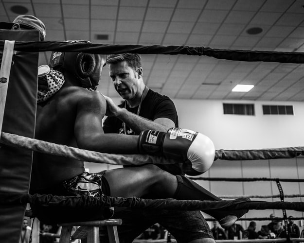

A significant part of the facilitator's role will be to provide academic coaching for FAR centre students. Coaching can happen with a group of students or one-on-one, and both situations require facilitators to consider the following principles and best practices. These notes have been taken from TWU's Coaching Manual used by the university's learning coaches.

---

The definition of a "coach" is someone who "meets students where they are at and provides direction, encouragement, correction, and wisdom to help the students become all they can be. The coach is process-focused, not product-focused. It is relational, not clinical. A coach is not an editor or tutor, not a "fixer" or a doctor. Coaches support the scholarly development of learners as they work on specific tasks, with clear targets"(Coaching Manual, p.1).

As noted above, the role of the coach is not to as simple as helping students with their homework. Coaches have a wider scope of the learning process than tutors do, and their goal is to come along side students and strategically move them towards becoming  **self-regulated learners**. Self-regulated learners are those who learn by choice with determination and agency, and the goal of the learning coach is to help students become self-regulated learners through developing in them these three things:

- Competence the sense of having control over one's environment, not being a victim or helpless
- Relatedness- being in relationship with others, being valued and cared for, which leads to a freedom to take risks in learning
- Autonomy- being able to make one's own decisions and do things independently, motivated by a sense of value and pleasure in learning.

To coach in a way that promotes self-regulated learning, consider these specific strategies:

-	Give students choices and when choices are restricted, discuss why
-	Use inviting language, such as “I’m interested in your idea. Can you tell me more about it?”
-	Be in tune to the learner’s personal state during a session and adapt accordingly (Reeve, 2006; as cited in Moreno-Murcia, 2016).
-	Do not shut down a student’s perspective or thought. Lead the student to ask themselves questions and seek more clarity on it.
-	Do not pressure the learner to accept your thought or perspective
-	Provide structure for each session. Help the learner understand the expectations for being successful in your sessions.
-	Encourage the learner to evaluate his or her sources of support, whether material or human
-	Welcome complaints and negative affect. Validate these emotions.
-	Never use guilt or shame tactics.

**Self-regulated learning through meta-cognitive skills**

The learning coach guide suggests that "student progress towards self-regulated learning is related to the ability to analyze and articulate their own learning and learning tasks"(p.8). With that in mind, facilitators recognize that this ability develops over time, and therefore they should use the coaching sessions as an opportunity for students practice this type of critical thinking and analysis about their own learning.

----

Social Competency

-----

Strategies for the coaching process:

---

Guidelines for best practices

* academic dishonesty
*

---
Other considerations:
* academic Dishonesty
* record-keeping
* Communicating with professors
* communicating with the supervisor
* At-risk Students
* Privacy
