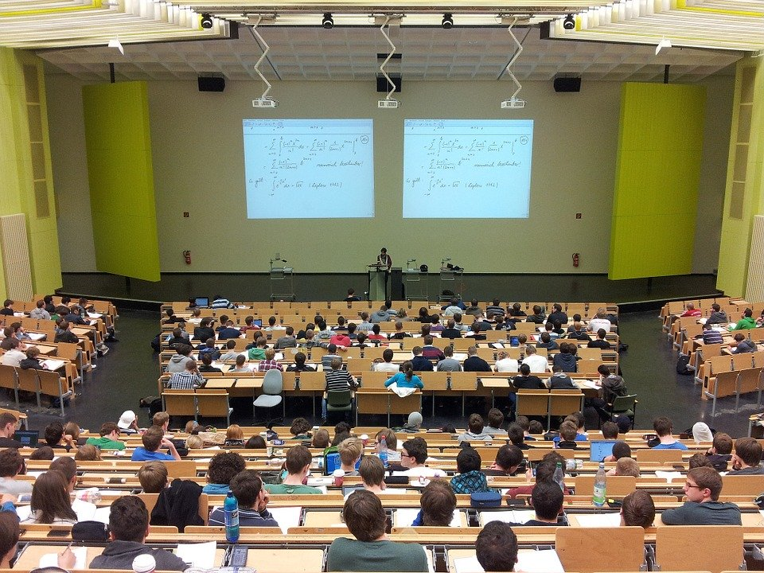

# Classroom Management Strategies

Classroom management is one of the most important processes that promote learning in the classroom. Without an atmosphere of peace and classroom control it is almost impossible for lessons to run smoothly.

###### Photo credit: Pixabay (nikolayhg)

There are various strategies that promote classroom management. It is safe to say that “there is no one size fits all” approach to classroom management. Strategies that work in one environment may fail to achieve the desired result in another classroom. The University of South Florida (2016) outlined the following five evidence-based classroom management strategies:

1. Maximize structure in the classroom
  - Predictable routines and procedures for student and staff
  - Environment elicits appropriate behavior; Minimize crowding and distractions
  - Easy traffic flow
  - Adequate supervision
  - Designate staff and student areas
  - Seating arrangements for various activities (groups, centers, independent work)

2. Teach, monitor, and reinforce expectations and rules
  - Aligned with school-wide expectations
  - Positively stated
  - Rules operationally defined
  - Explicitly taught, modeled, reinforced
  - Active supervision

3. Actively engage students
  - High rates of opportunities to respond
  - Link engagement with outcome objectives
  - Evidence based practices for active engagement
  - Direct Instruction
  - Computer Assisted Instruction
  - Class-wide Peer Tutoring
  - Guided notes
  - Response Cards

4. Continuum of classroom-implemented strategies to acknowledge appropriate behavior
  - Specific and Contingent Praise
  - Group Contingencies
  - Behavior Contracts
  - Token Economies

5. Continuum of classroom-implemented strategies to respond to inappropriate behavior
  - Error Corrections
  - Differential Reinforcement
  - Planned ignoring
  - Time out from reinforcement
