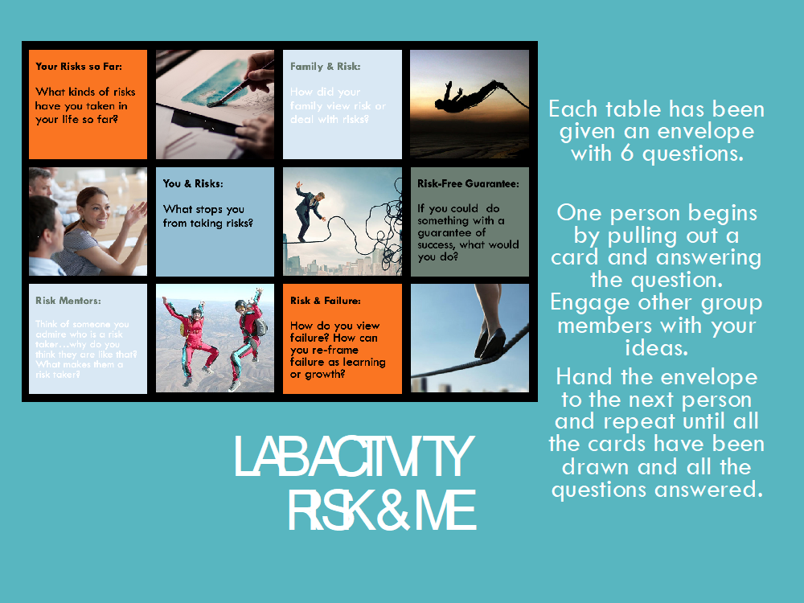

## Unit 4:  The Leader’s Behaviours: Understanding and Leveraging Risk

###Lab Activity: Lost at Sea  

This activity requires a minimum of 6 students (two groups of 3) but 4 students per group is ideal.
This activity is designed to spark discussions around what risk in leadership can look like, how decisions are made under pressure, how is consensus reached (or not reached) and being able to defend one’s decisions when the stakes are high. Start with reviewing the Lost at Sea PDF to structure and execute the activity. I have included the following for your use:
- PPT #4 *Lab_Lost at Sea* (can be used in the classroom)
- *Lost at Sea* PDF with instructions (for the facilitator)
- *Lost at Sea* Ranking Chart (Word document) to be handed out 1 per student (can be used in the classroom)

###Lab Activity: Risk & Me
This activity would be a good introduction to the topic activity. The activity is designed to spark discussion about risk and one’s thinking about risk. You could do this activity at the beginning of the lab and after the students have completed this unit, it may be of value to re-visit some of these questions to see if their any of their thinking has changed.
In the classroom, I have envelopes with these 6 questions printed and inside that I distribute. If those resources are unavailable to you, you could use this slide (or create your own) with the questions projected onto the screen in the class.

###*Topic 3: Let’s take a look at how Jesus was a risk taker.*

###Lab Activity: Concept Mapping
{c:red}Let students know whether this will be a full lab activity, or whether they should start/complete this sketch note at home. Ask students to send concept maps to the professor for review.{/c}

**Concept Mapping**: Create a risk concept map pulling together all the key learning from this unit. A concept map is a creative way to organize ideas on a topic that are connected in interesting ways. You can use paper and pen and then take a photo of your map. Or you can use online free software to help. A risk concept maps are ways to make connections between three sections of learning in this unit. Be creative. There are no wrong answers. This will help you decide what was most significant to you as you read, watched and distilled this rather large and layered topic of risk in leadership.

Additional Resources for this topic:
- Article: Creating a Concept Map [click here](https://creately.com/blog/diagrams/ultimate-concept-map-tutorial/)
