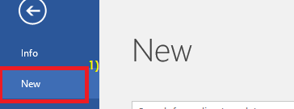
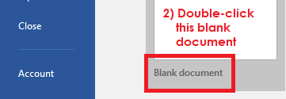
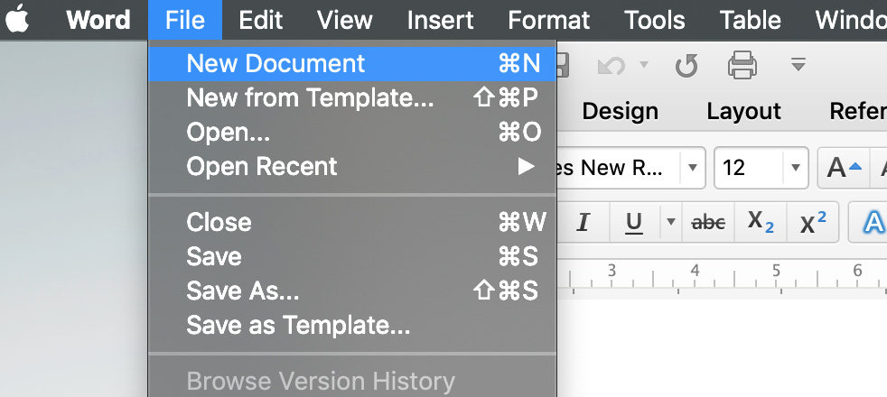
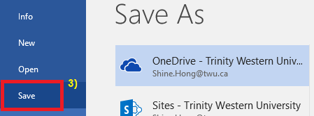
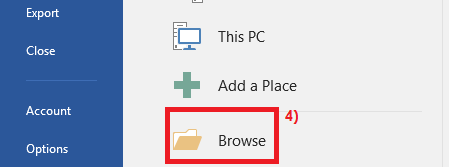
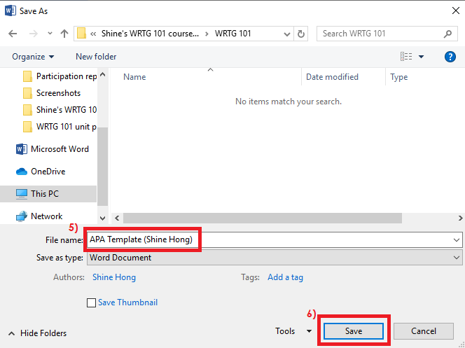
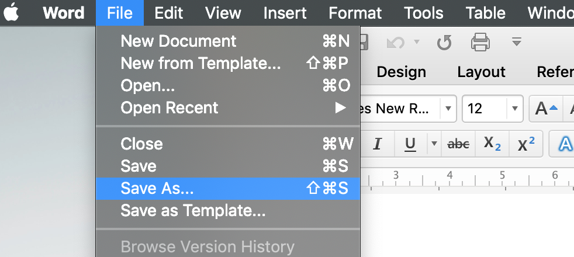
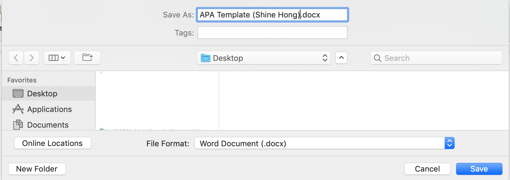

# WRTG 101

### Introduction to Academic Writing

### How to Create an APA Template

---

Read the following instructions for how to create your own APA template in Microsoft Word.  

Note that you may practice at home, but you will be required to complete all of the steps in class with your Facilitator and send your template to your instructor to be graded.

See Lab Activity 1.1 for more details.

---

# Create a new Document

---
Windows

  

---
macOS

  

---
# Save your Document

"APA Template (Your Official Name)"

---
Windows

---
Windows

    

---

macOS

---

macOS

---

etc...
